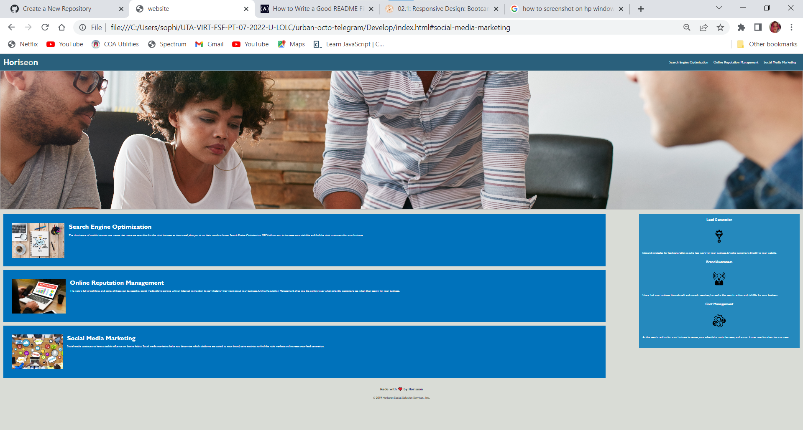

## Horiseon Website Code Refactor

**Goal**
- My main goal in this assignment was to practice refactoring website codes to make a better semantic HTML. My other main goal was to understand the importance of having experiance of meeting accessibility standards. I did my best to make sure the website was cleaner and more accessible than how it was given to me. 

**Revisions**
- I condensed a lot of the elements on the CSS Stylesheet to ensure that they were way cleaner and easieer to look at. I condensed the style elements as well as the tags and selectors. 

-There were a few things I was able to do in the HTML file to make it more conclusive and well-built. I added an ID to fix the link that wasn't working so it was functional. Next, I added alt image attributes that were much needed for strong accessibility. Lastly, I changed all the non descriptive tags with semantic HTML to work with accessibilty. 
- I finished by adding notes to the style sheet and the index.html page. It reads a description of what is happening within the stylesheet and html page. 

## Demo
View the website at the link below:

https://SophiaAramburu.github.io/first-homework/

## Credits

The original source code was provided by the Coding Bootcamp of UT Austin

## License

MIT License

Copyright (c) 2022 Sophia Aramburu

Permission is hereby granted, free of charge, to any person obtaining a copy
of this software and associated documentation files (the "Software"), to deal
in the Software without restriction, including without limitation the rights
to use, copy, modify, merge, publish, distribute, sublicense, and/or sell
copies of the Software, and to permit persons to whom the Software is
furnished to do so, subject to the following conditions:

The above copyright notice and this permission notice shall be included in all
copies or substantial portions of the Software.

THE SOFTWARE IS PROVIDED "AS IS", WITHOUT WARRANTY OF ANY KIND, EXPRESS OR
IMPLIED, INCLUDING BUT NOT LIMITED TO THE WARRANTIES OF MERCHANTABILITY,
FITNESS FOR A PARTICULAR PURPOSE AND NONINFRINGEMENT. IN NO EVENT SHALL THE
AUTHORS OR COPYRIGHT HOLDERS BE LIABLE FOR ANY CLAIM, DAMAGES OR OTHER
LIABILITY, WHETHER IN AN ACTION OF CONTRACT, TORT OR OTHERWISE, ARISING FROM,
OUT OF OR IN CONNECTION WITH THE SOFTWARE OR THE USE OR OTHER DEALINGS IN THE
SOFTWARE.
